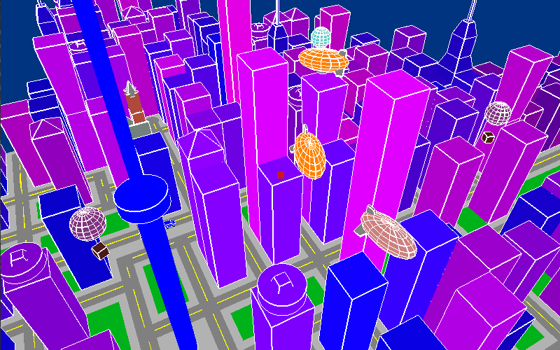
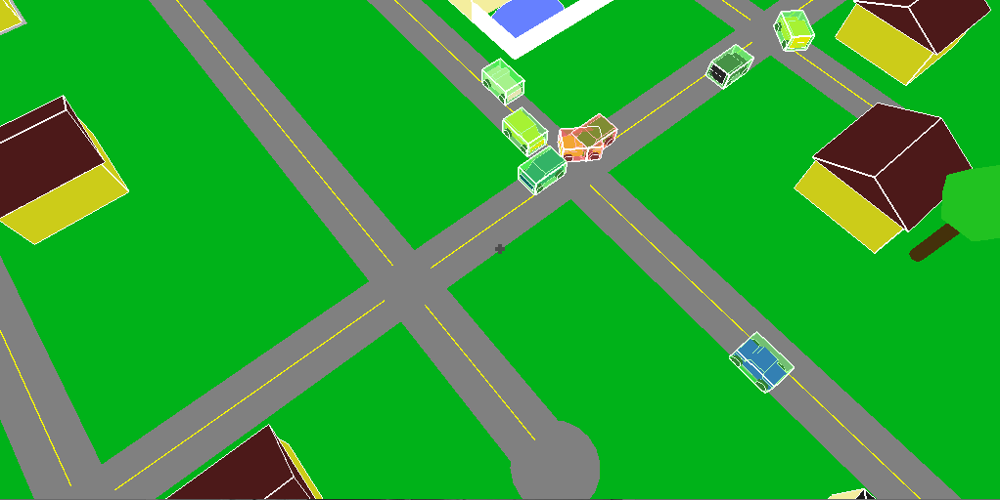
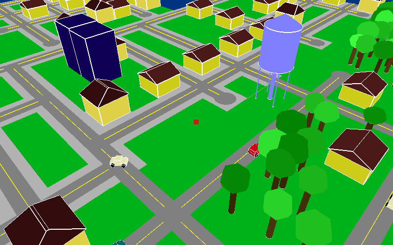
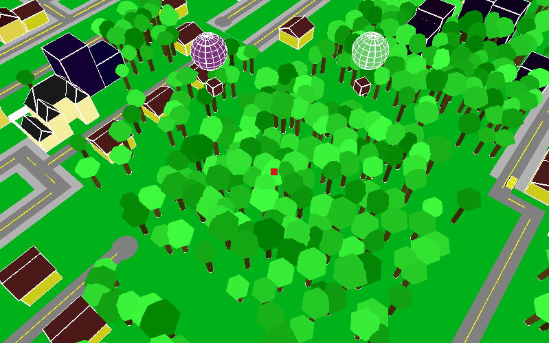
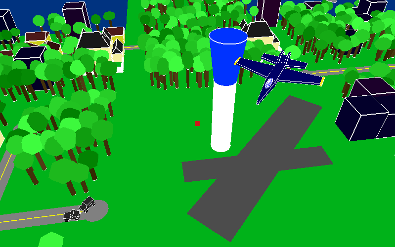
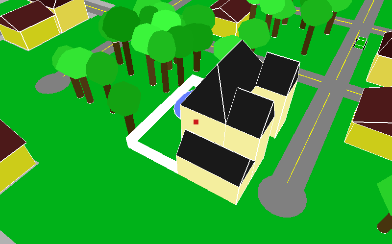
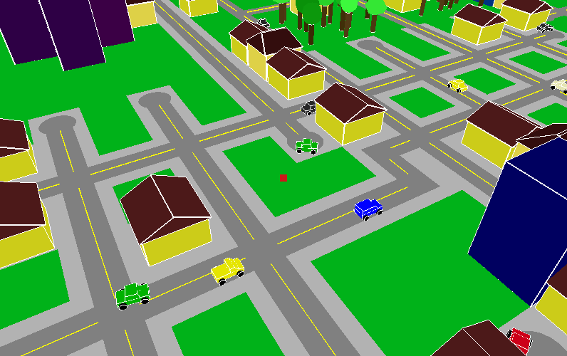
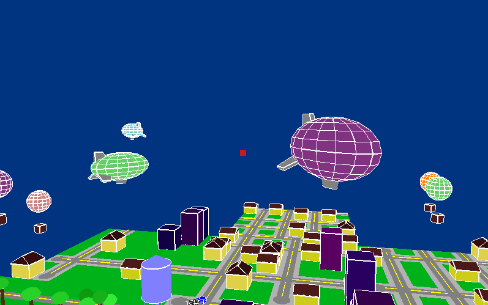
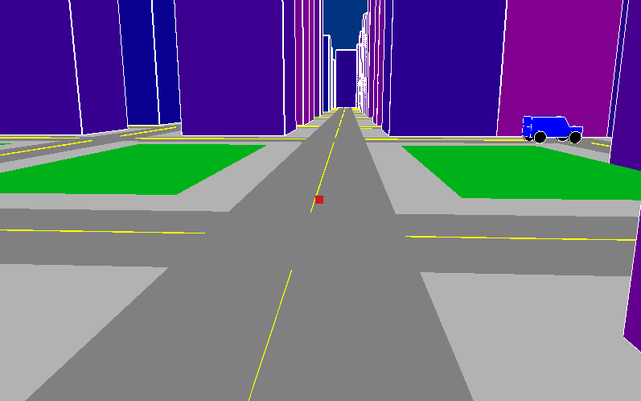

# complete-random-city
This program procedurally generates a 3d world that the user can
fly around and explore. It creates roads, buildings, cars, 
planes, skyscrapers, houses, and trees. Hold w,a,s, and d to move
around, and hold r and c to move up or down (respectively). Press
then escape key to close the window. You can also get your cursor
out of the window by moving it very suddenly to either side.

## Build Instructions
If you are on windows, you need to download freeglut, make the directory
 C:/Program Files/Common Files/freeglut/, copy the include/ and lib/ folders 
 from freeglut into there, and copy freeglut.dll from freeglut/bin/ into the 
 cmake-build-debug/ folder.

If you are not on windows, it should just work.
 
## Screenshots
A city.

Hitboxes detecting a collision.

The suburbs.

A forest with hot air balloons.

A plane taking off from the airport.

A mansion.

Cars driving on roads.

Blimps.

Roads in the city.

